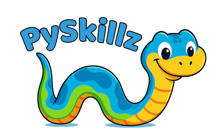

# Step 6: Testing Your New Exercise

Because your GitHub branch isn’t connected to a playground like the main PySkillz branch, your code can only be tested _online_ after it’s merged into the repository. Until then, you can test your code locally by following this two-step process.

* Write the solution as a learner would

  * Code a solution in `exercise_name.py` just as a playground user would.

  * Be sure to __save your changes__ before running tests.

* Run the exercise tests

  * Run `exercise_name_test.py` in your terminal.

  * When the exercise runs, you’ll see the __same output that users see in the playground__.

  * Formatting is slightly adjusted for terminal display, but the __content is identical__.

# Channels: Terminal vs Tech.io

In the __playground__, Tech.io organizes output into neat, separate channels: Success, Bug, Suggested Solution, and Standard Output. Locally, these channels are __simulated in the terminal__ by prefixing each line with the channel name and a symbol (e.g., `Win🎉>`, `Bug🐞>`, `Sol✅>`, `StdOut>`).

```text
Win🎉> Success Channel on Tech.io.
Bug🐞> Bug Channel on Tech.io.
Sol✅> Suggested Solution Channel on Tech.io.
StdOut> Standard Output Channel on Tech.io
```

This ensures that the __same information is visible locally__, even if the formatting isn’t as polished as Tech.io.

Any debug output sent to `sys.stderr` will follow your terminal’s default behavior locally, while Tech.io captures it in a dedicated __Standard Error__ panel.

<BR>

************

[](skillz-catalog)
